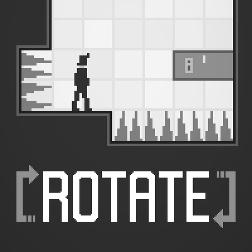

# ROTATE

Disassembled version of **ROTATE** game, originally made by [Light Wolf Studios](https://lightwolfstudios.com/).

## Links

### Original

### Disassembled

**[rotate-remake.pages.dev](https://rotate-remake.pages.dev/)**

## About

The repository is a try to break down the original minified source code of the ROTATE game to see how it's built.

### Project status

So far, all of the primary game entities got renamed to their human-readable names ([reference](https://github.com/satelllte/ROTATE/pull/9)). 

At this point, the main logic flow is readable to some extent. While it still might be quite hard to do so, it has a potential to be improved further by renaming more entities and simplifying more implementations. Additionally, the codebase can be a good start for a fresh remake, which could potentially bring some additional features to the ecosystem more easily (e.g., touch controls support).

## License

ROTATE game is the intellectual properly of [Light Wolf Studios](https://lightwolfstudios.com/). This repository holds no rights to the game itself; its sole purpose is to break down the game's technical construction for educational purposes.

## Contributing

See [CONTRIBUTING.md](CONTRIBUTING.md)
